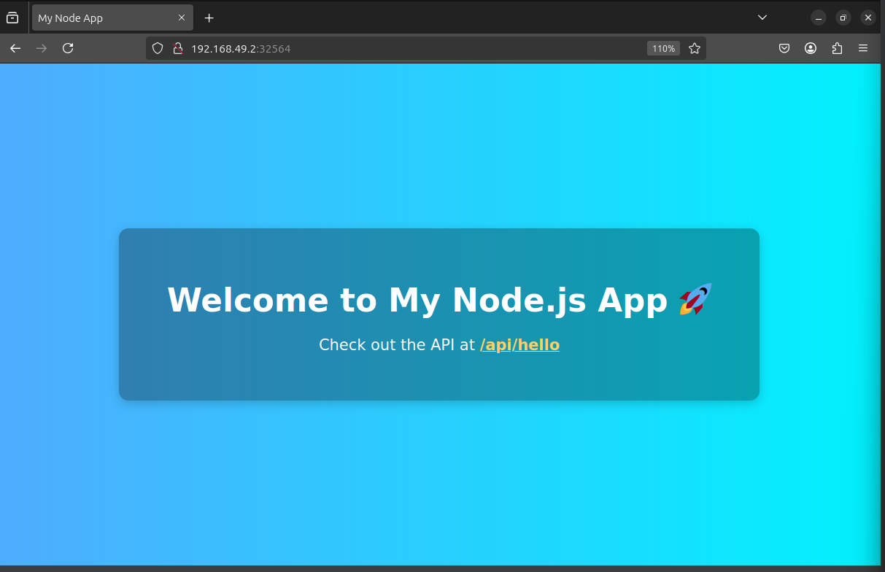
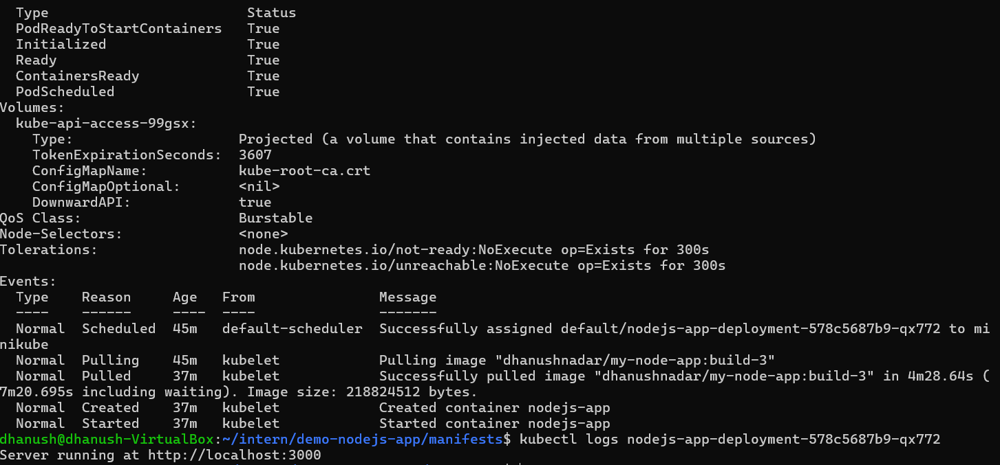

# 🚀 Kubernetes Deployment Project – CI/CD with Jenkins, Minikube, and Docker

Welcome to the **Kubernetes Local Deployment Project!** This project demonstrates how to deploy and manage applications inside Kubernetes using Minikube, kubectl, and Docker, and automate the deployment using a Jenkins CI/CD pipeline.

---

## 🌐 Live Screenshots

### 🖼️ Pod/Deployment/Service Status


### 🖼️ Main Page running on NodePort (K8s) - 32564


---

## 📁 Project Structure

```bash
.
├── Jenkinsfile               # Jenkins pipeline to auto-deploy on code change
├── manifests/
│   ├── deployment.yml         # Kubernetes Deployment manifest
│   └── service.yml            # Kubernetes Service manifest
├── Dockerfile                 # Dockerfile for Node.js app
├── index.js                   # Main Express app
├── package.json
├── .gitignore
└── README.md

```

## ✨ Tools Used

- 🐳 Docker (to containerize the app)

- ☸️ Minikube (local Kubernetes cluster)

- 🛠️ kubectl (to manage Kubernetes resources)

- 🤖 Jenkins (for automating the CI/CD process)

---

## 🧪 Setup and Run Locally

```bash
# Install and Start Minikube
minikube start --cpu=4 --memory=8192 --driver=docker

```


```bash
# Deploy Application on Kubernetes
kubectl apply -f manifests/deployment.yml
kubectl apply -f manifests/service.yml

# Verify Pods and Services
kubectl get pods
kubectl get services

# To get the IP of the Cluster
kubectl get nodes -o wide
```


```bash

# Scale Your Deployment
kubectl scale deployment nodejs-app-deployment --replicas=4

```


```bash

# Describe Resources and Fetch Logs
kubectl describe pod <pod-name>
kubectl logs <pod-name>
```



## 🐳 Docker Guide

### 🔨 Build Docker Image Locally

```bash
docker build -t my-node-app .
```

▶️ Run Docker Container Locally
```bash
docker run -p 3000:3000 my-node-app:
```


## 🤖 CI/CD Pipeline Using Jenkins

I have configured Jenkins to automatically deploy to Kubernetes when there is any code change in GitHub!

### ⚙️ How CI/CD Works:

- GitHub Webhook triggers Jenkins when you push code.

- Jenkins automatically:

- Checks out your code.

- Applies the deployment.yml and service.yml to Minikube.

- Your app is updated without manual steps! 🚀

---

## 📜 Summary


With this setup:

- ☸️ Minikube hosts your Kubernetes cluster.
- 🐳 Docker containers your Node.js app.
- ⚙️ kubectl manages deployments and scaling.
- 🤖 Jenkins automates deployment after every code push.
- 📸 Screenshots track your progress and deployment results.

---

> Made with ❤️ by Dhanush Nadar using Kubernetes, Docker, and Jenkins for a powerful DevOps learning experience!